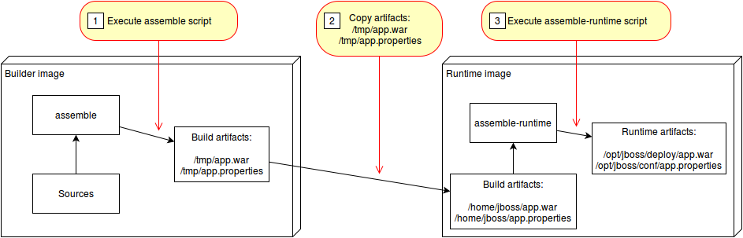

## Source To Image Builder for Open Liberty Applications on OpenShift

This project contains a S2I builder image which creates an image running Java web applications on [Open Liberty](https://openliberty.io/).

[Source-to-Image](https://github.com/openshift/source-to-image) (S2I) is a toolkit for building reproducible container images from source code. S2I produces ready-to-run images by injecting source code into a container image.

The Open Liberty builder can be used in two different environments:

* Local Docker runtime via 's2i'
* Deployment to OpenShift via 'oc new-app'

With interpreted languages like python and javascript, the runtime container is also the build container. For example, with a node.js application the 'npm install' is run to build the application and then 'npm start' is run in the same container in order to start the application.

However, with compiled languages like Java, the build and runtime processes can be separated. This will allow for slimmer runtime containers for faster application starts and less bloat in the application image.


(source: https://github.com/openshift/source-to-image/blob/master/docs/runtime_image.md)

This lab will focus on the second scenario of using a builder image along with a runtime image.

### Structure of this repository

### Setup

```bash
git clone https://github.com/odrodrig/s2i-open-liberty
```

```bash
cd s2i-open-liberty
```

```bash
ROOT_FOLDER=$(pwd)
```

The following prerequisites are needed:

* [docker](https://www.docker.com/products/docker-desktop)
* [s2i](https://github.com/openshift/source-to-image/releases)
* [A Docker Hub account](https://hub.docker.com)

### Build the builder image

1. Navigate to the builder image directory
```
cd ${ROOT_FOLDER}/builder-image
```

2. Export your docker username as an environment variable.
```
export DOCKER_USERNAME="Your docker username"
```

3. Build the builder image
```
docker build -t $DOCKER_USERNAME/s2i-open-liberty-builder:0.1.0 .
```

### Build the runtime image

1. Navigate to the runtime image directory

```
cd $ROOT_FOLDER/runtime-image
```

2. Build the runtime image
```
docker build -t $DOCKER_USERNAME/s2i-open-liberty:0.1.0 .
```

### Use S2I to build the application container

1. Use the builder image and runtime image to build the application image

```
cd $ROOT_FOLDER/sample
```

```
s2i build . $DOCKER_USERNAME/s2i-open-liberty-builder:0.1.0 authors --runtime-image $DOCKER_USERNAME/s2i-open-liberty:0.1.0 -a /tmp/src/target -a /tmp/src/server.xml
```

2. Run the newly built application

```
docker run -it --rm -p 9080:9080 authors
```

### Structure of the web applications

To use "s2i" or "oc new-app/oc start-build" you need two files:

* [server.xml](https://openliberty.io/docs/ref/config/serverConfiguration.html) in the root directory
* *.war file in the target directory


## Deployment to Openshift?


### Run the sample application on Minishift

First the builder image needs to be built and deployed:

```
$ cd ${ROOT_FOLDER}
$ eval $(minishift docker-env)
$ oc login -u developer -p developer
$ oc new-project cloud-native-starter
$ docker login -u developer -p $(oc whoami -t) $(minishift openshift registry)
$ docker build -t nheidloff/s2i-open-liberty .
$ docker tag nheidloff/s2i-open-liberty:latest $(minishift openshift registry)/cloud-native-starter/s2i-open-liberty:latest
$ docker push $(minishift openshift registry)/cloud-native-starter/s2i-open-liberty
```

After the builder image has been deployed, Open Liberty applications can be deployed:

```
$ cd ${ROOT_FOLDER}/sample
$ mvn package
$ oc new-app s2i-open-liberty:latest~/. --name=authors
$ oc start-build --from-dir . authors 
$ oc expose svc/authors
$ open http://authors-cloud-native-starter.$(minishift ip).nip.io/openapi/ui/
$ curl -X GET "http://authors-cloud-native-starter.$(minishift ip).nip.io/api/v1/getauthor?name=Niklas%20Heidloff" -H "accept: application/json"
```